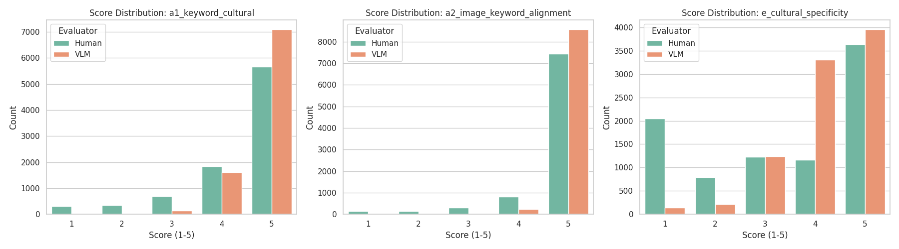
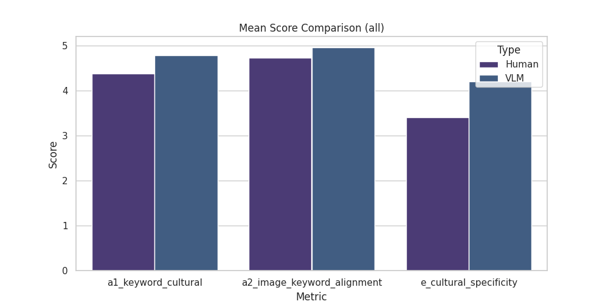
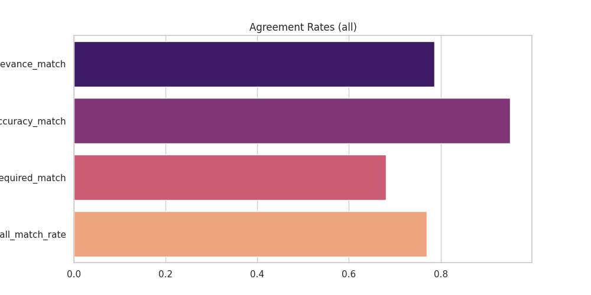
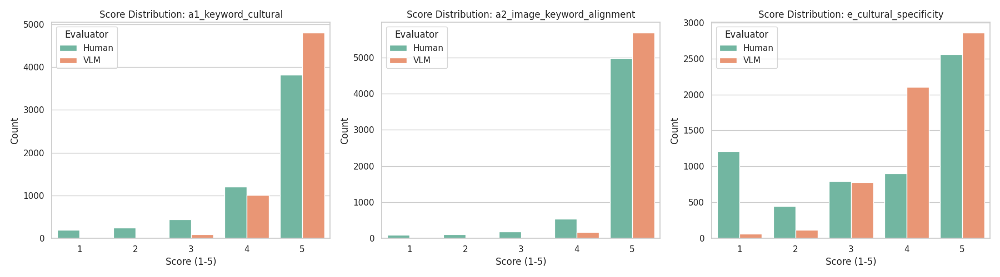
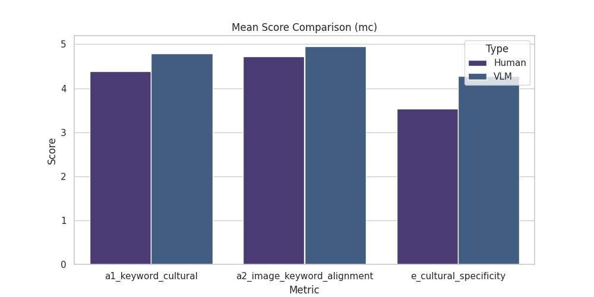
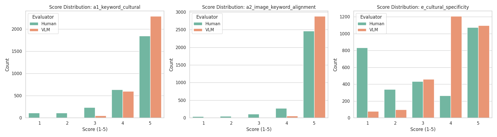
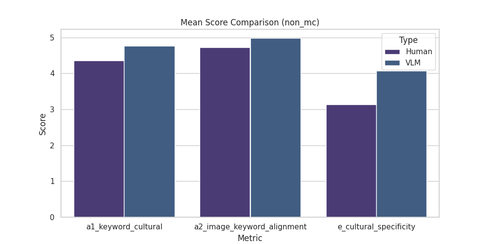
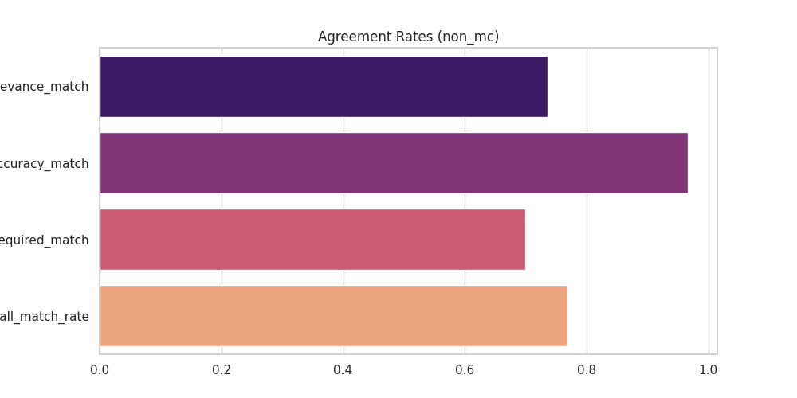

# 🏛️ 한국 문화 VQA: 인간-AI 메타 평가 리포트 (객관식/주관식 분류)

# VLM_CCA 데이터셋: 사람과 VLM 평가 분포 분석 보고서

본 보고서는 VLM_CCA 데이터셋을 바탕으로 사람 평가자와 VLM(시각-언어 모델) 간의 평가 분포를 다음과 같이 분석하였습니다. 분석은 전체, 객관식, 주관식 데이터로 나누어 각 지표별로 기술합니다. 특히 점수 분포 및 평가 패턴의 차이에 초점을 맞췄으며, 시각적 정합성 및 문화 특이성 분포의 시사점을 도출하였습니다.

---

## 1. 전체 데이터 분석

### 1.1. 지표별 평균 점수(Mean Scores)

| 지표 | Human | VLM |
|------|:---:|:---:|
| a1_keyword_cultural (키워드-문화 관련성) | 4.38 | 4.78 |
| a2_image_keyword_alignment (이미지-키워드 정합성) | 4.73 | 4.96 |
| e_cultural_specificity (문화 특이성) | 3.40 | 4.21 |

- **전반적으로 VLM이 모든 지표에서 사람보다 더 높은 점수를 부여하는 경향**이 나타남
- 특히 문화 특이성(e): VLM(4.21) > Human(3.40)으로 차이가 큼

### 1.2. 정답 정확성 분포 (d_answer_accuracy)

|     | correct | ambiguous | incorrect |
|-----|---------|-----------|-----------|
| Human | 8453 | 240 | 163 |
| VLM   | 8825 | -   | 31  |

- VLM의 'correct' 비율이 매우 높음, 'ambiguous', 'incorrect' 응답이 거의 없음

### 1.3. 점수 분포(Score Distribution) 상세 분석

#### a1_keyword_cultural (키워드-문화 관련성)

- **Human이 5점 준 문항(5666개)**: VLM 역시 5점(7094) 및 4점(1609)에 몰려, **사람 기준 최고점 부여 항목에 대해 VLM도 매우 후하게 평가**
- **Human이 낮은 점수(1~2점)를 준 경우**에도 VLM은 대부분 4~5점(약 8700건)으로, Human의 저평가에서 VLM의 '낙관적' 경향이 두드러짐

#### a2_image_keyword_alignment (이미지-키워드 정합성)

- **Human이 5점 준 비율(7441/8856 ≈ 84%)**, VLM은 더 많이 5점(8569/8856 ≈ 97%) 부여
- **시각적 정합성에 대해 VLM이 극단적으로 높은 점수**로 쏠림을 보임: 낮은 점수(1~3점)는 VLM에서 거의 존재하지 않음

#### e_cultural_specificity (문화 특이성)

- Human은 1점(2045), 2점(789), 3점(1225) 등 **다소 보수적/다양한 분포**
- VLM은 4,5점(7266/8856 ≈ 82%)로 **문화 특이성도 People 대비 더 후하게 점수 부여**
- 특히 Human이 1,2점 준 항목(2834회)에 대해 VLM은 1,2점 비율이 낮음(141+211=352)

### 1.4. 시사점 및 해석

- **VLM은 Human보다 전반적으로 점수 후하게, 분포가 상·고득점에 극단적으로 치우침**
- '시각적 정합성(a2)'의 경우 VLM 점수 분산이 거의 없고 대부분 5점, 이는 이미지와 키워드 관계에 관해 VLM의 평가 기준이 사람보다 훨씬 관대하거나 세밀한 오류 감지가 어려움 시사
- '문화 특이성(e)'에서도 VLM이 높은 점수로 편중, Human의 문화 맥락적 민감성이 VLM에는 부족할 수 있음을 반영

---

## 2. 객관식 문제 분석

### 2.1. 지표별 평균 점수(Mean Scores)

| 지표 | Human | VLM |
|------|:---:|:---:|
| a1_keyword_cultural | 4.39 | 4.79 |
| a2_image_keyword_alignment | 4.73 | 4.95 |
| e_cultural_specificity | 3.53 | 4.28 |

- 전반적 패턴은 전체 데이터와 유사

### 2.2. 정답 정확성 분포

|     | correct | ambiguous | incorrect |
|-----|---------|-----------|-----------|
| Human | 5610 | 195 | 109 |
| VLM   | 5883 | -   | 31  |

- VLM, 객관식에서 거의 완전 정답(5883/5914 ≈ 99.5%)
- Human 대비 'ambiguity'는 다소 존재

### 2.3. 점수 분포(Score Distribution)

#### a1_keyword_cultural

- Human이 5점(3823/5914 ≈ 65%) 준 문제 대부분 VLM도 5점(4805/5914 ≈ 81%), 4점(1009/5914 ≈ 17%) 부여
- **낮은 점수 구간(1~2점)에서 VLM은 4~5점에 극단적으로 치우침**

#### a2_image_keyword_alignment

- Human 5점(4978/5914 ≈ 84%), VLM 5점(5687/5914 ≈ 96%)로 VLM 압도적 고득점 쏠림
- Human이 낮은 점수(1~3점)를 준 경우 VLM은 거의 4~5점만 존재: **관대함 혹은 오류 감지 결여**

#### e_cultural_specificity

- Human이 5점(2559/5914 ≈ 43%), VLM 5점(2860/5914 ≈ 48%)+4점(2102/5914 ≈ 36%)로 고득점(84%)
- Human은 중저점(1~3점)이 절반 이상(2455/5914 ≈ 41%), VLM은 저점이 거의 없음

### 2.4. 시사점

- **객관식에서는 Human의 점수 분포도 이미 고점에 치우쳐 있으나**, VLM은 한층 더 분산 없이 4~5점 쏠림
- Human 평가의 엄격성보다 VLM의 평가가 훨씬 관대, 특히 오류나 미묘함 감지에서 성능 한계

---

## 3. 주관식 문제 분석

### 3.1. 지표별 평균 점수(Mean Scores)

| 지표 | Human | VLM |
|------|:---:|:---:|
| a1_keyword_cultural | 4.36 | 4.76 |
| a2_image_keyword_alignment | 4.72 | 4.98 |
| e_cultural_specificity | 3.14 | 4.07 |

- **주관식에서 Human 점수가 가장 낮아짐(문화 특이성 3.14 → 전체/객관식 대비 가장 낮음)**
- VLM 역시 일부 미세하게 감소하지만 여전히 Human 대비 높음

### 3.2. 정답 정확성 분포

|     | correct | ambiguous | incorrect |
|-----|---------|-----------|-----------|
| Human | 2843 | 45 | 54 |
| VLM   | 2942 | - | - |

- VLM은 전문항 correct(2942/2942) → 주관식 변별력을 인지하지 못함
- Human은 ambiguous/incorrect도 비교적 많음

### 3.3. 점수 분포(Score Distribution)

#### a1_keyword_cultural

- Human 5점(1843/2942 ≈ 62%) → VLM 5점(2289/2942 ≈ 78%)로 쏠림
- Human의 저점(1~2점, 223건) 구간에 VLM은 1~2점 거의 드물고, 역시 고점 편중

#### a2_image_keyword_alignment

- Human 5점(2463/2942 ≈ 84%), VLM 5점(2882/2942 ≈ 98%)로 5점에 극단적으로 집중
- Human 저점(1~3점, 203건)에서 VLM은 대부분 5점

#### e_cultural_specificity

- Human은 1점(834건, 28%), 2점(338건, 11%), 합산해 40% 이상이 저점
- VLM은 1–2점 합계(177/2942 ≈ 6%)에 불과, 대부분 4~5점(2304/2942 ≈ 78%) 에 쏠림

### 3.4. 시사점

- **주관식에서 사람은 점수 분포가 넓고 더 비판적/보수적**: 특히 문화 특이성(e)에서 낮은 점수 많음(문항의 모호성, 문맥 다양성, 문제 난이도 등 반영 가능)
- VLM은 문제 유형과 무관하게 4~5점 집중 → 사람 평가의 미묘한 차이, 맥락 해석, 문화적 nuance에 민감하지 않음
- **주관식에서 Human-VLM 평가 차이가 가장 두드러짐**

---

## 4. 객관식 vs. 주관식: 평가 패턴 차이 분석

### 4.1. Human 평가의 차이

- 주관식 문제에서 **사람은 전체적으로 더 낮은 점수와 다양한 분포**를 보임 (특히 문화 특이성)
- 객관식은 구조적 힌트·정답 옵션이 있어 점수 평균과 분포가 더 높고 좁음

### 4.2. VLM 평가 경향

- **문제 유형에 관계없이 VLM은 대부분 4~5점 분포로 일관**
- 주관식에서도 사람의 저점 평가를 거의 무시/감지불가 → 사람의 문항 난이도, 문화적 nuance, 맥락적 함의 반영 한계

### 4.3. 점수 분포 연관

- Human이 5점(특히 주관식에서조차)이면 VLM은 거의 예외 없이 5점, 낮은 점수도 4~5점
- Human의 1~2점 문제에서도 VLM은 (상대적으로) 흔히 4~5점
- VLM은 평가의 변별력·비판적 민감성 부족, 단순하고 긍정적 예측 경향

### 4.4. 시각적 정합성(a2), 문화 특이성(e) 분포 시사점

- 시각적 정합성(a2): Human도 5점 비율 높으나 VLM은 99% 가깝게 5점→ VLM은 이미지-키워드 정합성 문항에서 극단적 관대함
    - 사람은 미묘한 부조화, 상벌점 더 감지
- 문화 특이성(e): Human은 넓은 분포(특히 주관식에서 저점 많음) → 문화성, 맥락의 미묘함에 다양하게 반응
    - VLM은 문화 특이성조차 4~5점 전향적 평가, 문화성 판단에서 사람 특유의 맥락적 사고·비판성 결여

---

## 5. 결론 및 시사점

- **VLM은 객관식·주관식 구분, 그리고 Human 평가자의 세밀함과는 달리, 모든 측정항목에서 지나치게 긍정적이고 분산이 적은 평점 경향**을 보임
- **사람이 고점을 준 경우에는 거의 예외 없이 VLM도 동일**하나, **사람이 저평가(1~2점)한 문제에서도 VLM의 고점 경향(4~5점)이 강하게 나타남**
- **시각적 정합성은 특히 VLM 평가에서 높은 bias로, 거의 모든 문항을 완전히 정합하다고 간주**
- **문화 특이성에서는 Human의 더 넓은 분포와 VLM의 피상적/후한 평가 차이**가 사람과 AI의 문화적 맥락 해석력 차이를 드러냄

### 개선 제언

- VLM 평가 시스템은 Human 평가의 분포와 패턴 학습 및 편향 교정(underfitting한 맥락 민감성 보완)이 숙제로 남음
- 문화적 nuance와 평가 변별력 강화를 위해, 정제된 경계 사례(특히 Human 저점 평정 사례 진단)가 필요한 시사점 제공

---
## 📊 시각 데이터 분석

### 전체 데이터 (All)
#### 1. 지표별 점수 분포 (Score Distribution)
> **설명**: 각 지표별로 사람과 VLM이 부여한 점수(1~5)의 빈도수를 비교합니다. AI의 평가 편향성을 확인할 수 있습니다.

#### 2. 정량 지표 평균 비교

#### 3. 지표별 일치율

---

### 객관식 문제만 (Multiple Choice)
#### 1. 지표별 점수 분포

#### 2. 정량 지표 평균 비교

#### 3. 지표별 일치율

---

### 주관식 문제만 (Non-Multiple Choice)
#### 1. 지표별 점수 분포

#### 2. 정량 지표 평균 비교

#### 3. 지표별 일치율

